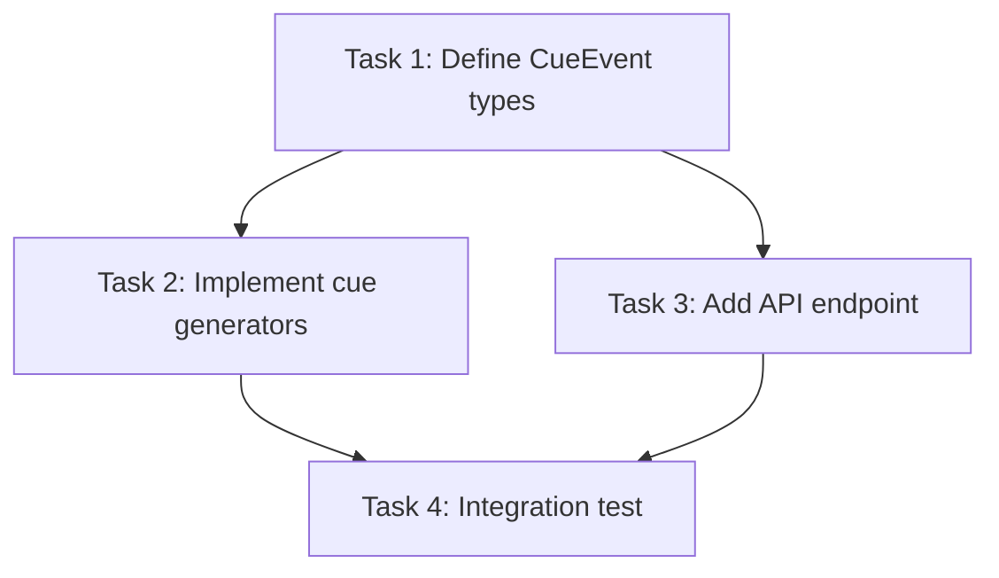

# SCUE Handoff Contracts — Inter-Agent Communication Protocol

> This document defines the **format** of artifacts passed between agents.
> Think of it as type-safety for agent communication: every output must conform
> to the expected shape so the receiving agent can consume it without ambiguity.

---

## Core Principle: Write Once, Read by Reference

Agents never "tell" each other things verbally. They write structured artifacts to files.
The Orchestrator tells Brach which file to feed to the next agent. This means:

- **No copy-pasting conversation history** between agents. Ever.
- **No "continue where the last agent left off."** Each agent starts fresh.
- **Artifacts are the only communication channel.** If it's not in a file, it doesn't exist for the next agent.

---

## Artifact Registry

Every artifact type has a defined schema. Agents that produce artifacts MUST follow these schemas.
Agents that consume artifacts can rely on these schemas being present.

### 1. Research Finding

**Produced by:** Researcher
**Consumed by:** Architect, Orchestrator
**Location:** `research/[topic-slug].md`

```
# Research: [Topic Title]
## Question
[The specific question investigated]
## Summary
[2-3 sentence answer]
## Findings
### [Finding 1 Title]
- Source: [URL or document name]
- Relevance: [HIGH | MEDIUM | LOW]
- Detail: [Concise description]
### [Finding 2 Title]
...
## Recommendation
[What the researcher suggests for SCUE, with justification]
## Constraints Discovered
[Any hard limits, compatibility issues, or deal-breakers found]
## Open Questions
[What couldn't be resolved]
```

---

### 2. Architecture Decision Record (ADR)

**Produced by:** Architect
**Consumed by:** All implementation agents (via DECISIONS.md reference)
**Location:** Appended to `docs/DECISIONS.md`

```
## ADR-[NNN]: [Decision Title]
**Status:** Accepted | Proposed | Superseded by ADR-[NNN]
**Date:** YYYY-MM-DD
**Context:** [Why this decision was needed]
**Decision:** [What was decided]
**Alternatives Considered:**
- [Alternative A]: [Why rejected]
- [Alternative B]: [Why rejected]
**Consequences:**
- [Positive consequence]
- [Negative consequence / tradeoff]
**Affects:** [Which layers/agents this constrains]
```

---

### 3. Feature Specification

**Produced by:** Architect
**Consumed by:** Implementation agents (via Orchestrator handoff)
**Location:** `specs/[feature-slug]/spec.md`

```
# Spec: [Feature Title]
## Objective
[One sentence: what this feature accomplishes for the user]
## Behavior
[Detailed description of expected behavior, including edge cases]
## Inputs
[Exact types/shapes this feature receives — reference CONTRACTS.md definitions]
## Outputs  
[Exact types/shapes this feature produces — reference CONTRACTS.md definitions]
## Acceptance Criteria
- [ ] [Testable criterion 1]
- [ ] [Testable criterion 2]
- [ ] [Testable criterion 3]
## Constraints
[Non-negotiable rules from DECISIONS.md, CONTRACTS.md, or Brach's requirements]
## Out of Scope
[Explicitly: what this feature does NOT do]
## [DECISION NEEDED] Items
- [Any unresolved question that requires Brach's input before implementation]
```

---

### 4. Implementation Plan

**Produced by:** Architect
**Consumed by:** Orchestrator (for task dispatch), implementation agents (for context)
**Location:** `specs/[feature-slug]/plan.md`

```
# Plan: [Feature Title]
## Approach
[High-level strategy, 2-3 paragraphs max]
## Layer Boundaries
[Which layers are touched, and where the interfaces are]
## Interface Definitions
[Exact dataclass / TypeScript type definitions for new or modified contracts]
[These are copy-paste ready — not prose descriptions]
## Dependency Order
[Which tasks must complete before others can start]

## Risk Register
- [Risk 1]: [Mitigation]
- [Risk 2]: [Mitigation]
```

---

### 5. Task Checklist

**Produced by:** Architect
**Consumed by:** Orchestrator (for dispatch), implementation agents (one task at a time)
**Location:** `specs/[feature-slug]/tasks.md`

```
# Tasks: [Feature Title]

## Task 1: [Title]
- **Agent:** [AGENT: Bridge L0 | Analysis L1A | Tracking L1B | Cue Gen L2 | API | FE-State | FE-UI]
- **Layer:** [Layer 0 | Layer 1A | Layer 1B | Layer 2 | API | Frontend-State | Frontend-UI]
- **Depends on:** [Task N, or "None"]
- **Inputs:** [What this task receives — file references or artifact references]
- **Outputs:** [What this task produces — file changes, new files, test results]
- **Acceptance criteria:**
  - [ ] [Criterion 1]
  - [ ] [Criterion 2]
- **Estimated complexity:** [Small (<15 min) | Medium (15-30 min) | Large (split further)]
- **Status:** [ ] Not started | [~] In progress | [x] Complete

## Task 2: [Title]
...
```

**Atomization rule:** Any task tagged `Large` must be split before dispatch. The Orchestrator should push back.

---

### 6. Session Summary

**Produced by:** Every implementation agent at the end of its session
**Consumed by:** Orchestrator, Reviewer, next agent in the chain
**Location:** `sessions/[date]-[agent]-[task-slug].md`

```
# Session: [Agent Role] — [Task Title]
**Date:** YYYY-MM-DD
**Agent:** [Role name]
**Task:** [Reference to specs/*/tasks.md task number]

## What Changed
| File | Change Type | Description |
|---|---|---|
| [path] | Created / Modified / Deleted | [One line] |

## Interface Impact
[Changes to CONTRACTS.md types, API endpoints, or WebSocket messages. "None" if unchanged.]

## Tests
| Test | Status |
|---|---|
| [test name] | ✅ Pass / ❌ Fail / 🆕 New |

## Decisions Made During Implementation
[Any judgment calls the agent made. These should be reviewed by Brach.]

## Questions for Brach
[Anything the agent was uncertain about but proceeded with a stated assumption.]
[Format: "I assumed X because Y. Please confirm or correct."]

## Remaining Work
[Anything not finished. Becomes input for the next session's handoff.]

## LEARNINGS.md Candidates
[Any pitfalls or non-obvious behaviors discovered that should be documented.]
```

---

### 7. Review Report

**Produced by:** Reviewer
**Consumed by:** Orchestrator (for dispatch of fixes)
**Location:** `reviews/[date]-[feature-slug].md`

```
# Review: [Feature/Task Title]
**Reviewed:** [List of files or session summaries reviewed]
**Spec:** [Reference to specs/*/spec.md]

## Verdict: [PASS | PASS WITH NOTES | NEEDS FIXES]

## Contract Compliance
| Contract | Status | Notes |
|---|---|---|
| [Type name from CONTRACTS.md] | ✅ Aligned / ⚠️ Drifted / ❌ Violated | [Detail] |

## Layer Boundary Check
| Boundary | Status |
|---|---|
| [L0 → L1B] | ✅ Clean / ❌ Violation: [detail] |

## Issues Found
### Must Fix
1. **[File:line]** — [Description of issue, why it's a must-fix]
2. ...

### Nice to Have
1. **[File:line]** — [Suggestion]
2. ...

## Coding Standards
- Type hints: [✅ / ⚠️ missing in: ...]
- Async patterns: [✅ / ⚠️ blocking call in: ...]
- Error handling: [✅ / ⚠️ bare except in: ...]
- Test coverage: [✅ / ⚠️ untested: ...]
```

---

## Handoff Flow Diagram

```
Orchestrator
    │
    ├─→ Researcher ──→ research/*.md ──→ Architect
    │                                        │
    │                                        ├─→ docs/DECISIONS.md (ADR)
    │                                        ├─→ docs/CONTRACTS.md (interface update)
    │                                        ├─→ specs/*/spec.md
    │                                        ├─→ specs/*/plan.md
    │                                        └─→ specs/*/tasks.md
    │                                                │
    ├─→ [Implementation Agent] ←── (task handoff) ───┘
    │         │
    │         └─→ sessions/*.md (session summary)
    │                   │
    ├─→ Reviewer ←──────┘
    │         │
    │         └─→ reviews/*.md (review report)
    │                   │
    └─── (fix dispatch) ┘
```

---

## Anti-Patterns

| Anti-Pattern | Why It Fails | Do This Instead |
|---|---|---|
| Pasting Agent A's conversation into Agent B | Imports noise, dead ends, hallucinated context | Pass only the session summary artifact |
| Telling an executor "see the plan for details" without pasting the relevant section | Agent may misinterpret or skip reading | Orchestrator extracts the relevant plan section into the handoff packet |
| Letting an executor modify CONTRACTS.md directly | Contract changes need cross-agent coordination | Executor flags "Interface Impact" in session summary → Architect updates contracts |
| Skipping the session summary | Next agent has no structured input | Every session ends with a summary. No exceptions. |
| Combining tasks from different agents into one session | Context pollution, scope creep | One agent, one task, one session. The Orchestrator enforces this. |
